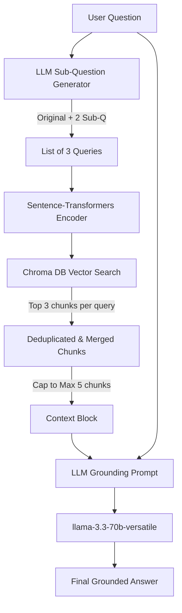

# RAG Projects: Simple & Advanced Retrieval-Augmented Generation

This repository contains two implementations of Retrieval-Augmented Generation (RAG) systems. It demonstrates the journey from a simple dictionary-based retrieval mechanism to a production-grade RAG pipeline featuring a local vector database, multi-query expansion, and a responsive Flask web application.

---

## 🌟 Features

### 21. Real RAG with ChromaDB (`rag project.py` & `rag_project_notebook.ipynb`)
A fully-featured RAG system representing a customer support assistant for **Royal Spice Restaurant (Hyderabad)**.
* **Document Ingestion**: Loads restaurant details (menus, pricing, hours, policies) from `knowledge_base.txt`.
* **Text Chunking**: Splits documents into digestible segments using LangChain's `CharacterTextSplitter` (configured with a chunk size of 300 and overlap of 60).
* **Dense Embeddings**: Creates vector embeddings using the `sentence-transformers/all-MiniLM-L6-v2` model.
* **Vector Storage**: Indexes and persists embeddings locally in a `chroma_db` directory.
* **Multi-Query Retrieval (Sub-Questions)**: Generates 2-3 alternative search queries from the user input to ensure robust context retrieval (combats keyword-matching limitations).
* **Deduplication & Capping**: Aggregates, deduplicates, and limits retrieved chunks to the top 5 to keep context precise and cost-effective.
* **CLI Chat Interface**: Interactive terminal loop that highlights the generated sub-questions, retrieved source chunks, and model responses in color-coded output.

### 2. Flask Web Interface (`app.py` & `templates/index.html`)
A beautiful, modern web-based chatbot for the Royal Spice Restaurant.
* **Flask Server**: Hosts a lightweight backend, dynamically imports the RAG logic, and exposes APIs for processing chat exchanges.
* **Modern UI**: Features a dark-themed glassmorphism interface styled with custom fonts (Inter) and font-awesome icons.
* **Text-to-Speech (TTS)**: Built-in voice synthesis allowing users to listen to the chatbot's responses. Features custom controls that automatically prioritize female English voices and accelerate speech for natural listening.
* **UX Enhancements**: Includes responsive layouts (mobile-friendly), typing indicator animations, and smooth auto-scrolling.

---

## 🛠️ Tech Stack

* **Core Language**: Python 3.10+
* **LLM API Provider**: [Groq Cloud](https://console.groq.com/) (using `llama-3.3-70b-versatile`)
* **RAG Framework**: LangChain
* **Vector Database**: ChromaDB
* **Embeddings**: HuggingFace Sentence Transformers (`all-MiniLM-L6-v2`)
* **Web Server**: Flask (Python)
* **Frontend**: HTML5, CSS3 (Vanilla), JavaScript (Vanilla)

---

## 📂 Directory Structure

```text
rag projects/
│
├── chroma_db/                  # Local directory for persisted Chroma vector store
├── templates/
│   └── index.html              # Frontend UI for the Flask web application
├── .env                        # Environment file containing credentials (API keys)
├── app.py                      # Flask web application entry point
├── knowledge_base.txt          # Raw text data source containing Royal Spice details
├── rag project.py              # Real RAG implementation with multi-query logic

```

---

## 🚀 Setup & Installation


### 1. Install Dependencies
Make sure you have Python installed. You can install all necessary packages via `pip`:
```bash
pip install langchain langchain-community langchain-huggingface langchain-chroma chromadb langchain-groq sentence-transformers python-dotenv flask
```

### 3. Configure Environment Variables
Create a file named `.env` in the root directory (if it doesn't already exist) and add your Groq  API key (it is a free source):
```env
GROQ_API_KEY=your_actual_groq_api_key_here
```
*You can get a free API key from the [Groq Console](https://console.groq.com/).*

---

## 🎮 How to Run

### Run the RAG CLI (Restaurant Chatbot)
Launch the console-based vector store RAG application:
```bash
python "rag project.py"
```
*Try asking: `"which is cheaper, chicken biryani or mutton biryani?"` or `"Is rooftop dining available today?"`*

---

### Run the Web Chatbot Application
Launch the Flask development server:
```bash
python app.py
```
1. Open your browser and go to `http://127.0.0.1:5000/`.
2. Interact with the chat interface.
3. Click the volume icon 🔊 on any message to trigger the Text-to-Speech assistant speaker.

---

## 🔍 How the RAG Pipeline Works



1. **Sub-Question Generation**: When a user inputs a query like `"Is the restaurant open and do you have biryani?"`, the system generates sub-queries (`"What are the working hours?"`, `"Do you serve biryani?"`).
2. **Multi-Query Vector Retrieval**: The system generates embeddings for all 3 queries and searches the Chroma database.
3. **Deduplication**: Since queries overlap, similar results are returned. Chunks are deduplicated by content to conserve token budget.
4. **Context Injection**: Chunks are merged into a single block of context and injected into the LLM system prompt.
5. **Grounded Generation**: The LLM responds to the user query using *only* the retrieved context, maintaining conversation memory.
